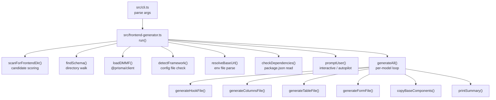

# Design Document: frontend-generator

## Overview

The `generate:frontend` command extends the omni-rest CLI to scaffold a complete, production-ready frontend data layer for every Prisma model. Given a Prisma schema, it generates TanStack Query hooks, TanStack Table column definitions, DataTable wrapper components, and FormGenerator wrapper components — all typed against `@prisma/client` and wired to the omni-rest REST API.

The generator is implemented as a new module `src/frontend-generator.ts` (and supporting files) that is invoked from the existing `src/cli.ts` entry point. It reuses the existing `getModels` / `toRouteName` utilities from `src/introspect.ts` and adds no new runtime dependencies to the omni-rest package itself.

### Design Goals

- Zero-config for the common case: auto-detect framework, schema, frontend dir, and API base URL.
- Programmatic string building (no template engine dependency) — keeps the package lean and the output predictable.
- Idempotent: re-running the command regenerates files safely.
- Composable: each generation step is a pure function from config → string, making it independently testable.

---

## Architecture



The generator is a single async pipeline. Each stage is a pure function or a thin async wrapper around file I/O, making the stages independently unit-testable.

---

## Components and Interfaces

### Module layout

```
src/
  cli.ts                      ← adds generate:frontend branch
  frontend-generator.ts       ← main orchestrator (run())
  frontend/
    scan.ts                   ← scanForFrontendDir, scoreCandidates
    schema.ts                 ← findSchema, loadDMMF
    detect.ts                 ← detectFramework, resolveBaseUrl
    deps.ts                   ← checkDependencies
    prompt.ts                 ← buildConfig (interactive + autopilot)
    codegen/
      hook.ts                 ← generateHookFile()
      columns.ts              ← generateColumnsFile()
      table.ts                ← generateTableFile()
      form.ts                 ← generateFormFile()
      utils.ts                ← shared helpers (camelToTitle, fieldTypeMap, etc.)
    output.ts                 ← writeFile, copyBaseComponents, printSummary
```

### Key interfaces

```typescript
// The resolved, validated configuration for a single generation run
interface GeneratorConfig {
  frontendDir: string;
  schemaPath: string;
  framework: "nextjs" | "vite-react" | "react";
  baseUrl: string;
  outputDir: string;
  autopilot: boolean;
  models: ModelConfig[];
  staleTime: number;
  gcTime: number;
  noOptimistic: boolean;
  steps: "auto" | "always" | "never";
}

// Per-model configuration resolved from prompts or autopilot defaults
interface ModelConfig {
  model: ModelMeta;           // from src/introspect.ts
  tableFields: string[];      // scalar field names to show in table
  formFields: string[];       // scalar field names to show in form
  relationalFields: string[]; // relational field names to render as searchable-select
  bulkDelete: boolean;
  canExport: boolean;
  multiStep: boolean;
}

// Result of writing a single file
interface FileResult {
  path: string;
  status: "created" | "overwritten" | "skipped" | "error";
  error?: Error;
}
```

### CLI flag interface

```
npx omni-rest generate:frontend [options]

  --schema <path>         Path to schema.prisma (default: auto-discover)
  --frontend-dir <path>   Frontend project root (default: auto-scan)
  --out <dir>             Output directory relative to frontend-dir (default: src/)
  --models <names>        Comma-separated model names to generate (default: all)
  --autopilot             Skip all prompts, use defaults
  --no-bulk               Disable bulk delete hooks and wiring
  --no-optimistic         Disable optimistic update patterns
  --stale-time <ms>       useQuery staleTime (default: 30000)
  --gc-time <ms>          useQuery gcTime (default: 300000)
  --steps <mode>          Multi-step form mode: auto | always | never (default: auto)
  --help                  Print this help
```

---

## Data Models

### Candidate Frontend scoring

The scanner assigns integer scores to candidate directories to rank them for the confirmation prompt:

| Signal | Score |
|---|---|
| Contains `next.config.js` or `next.config.ts` | 10 |
| Contains `vite.config.ts` or `vite.config.js` | 10 |
| `package.json` lists `react` as direct dependency | 5 |
| `package.json` lists `react` as devDependency | 3 |
| Directory is the current working directory | +2 bonus |

Directories with score 0 are excluded. Results are sorted descending by score.

```typescript
interface CandidateFrontend {
  dir: string;       // absolute path
  score: number;
  signals: string[]; // human-readable reasons, e.g. ["next.config.js found"]
}
```

### DMMF field → FormGenerator field type mapping

The `fieldTypeMap` pure function in `codegen/utils.ts` maps Prisma scalar types to FormGenerator field type strings:

| Prisma type | FormGenerator type |
|---|---|
| `String` | `"text"` |
| `Int` / `Float` / `Decimal` | `"number"` |
| `Boolean` | `"switch"` |
| `DateTime` | `"date"` |
| `Json` | `"textarea"` |
| Enum | `"select"` |
| Relational (`kind === "object"`) | `"searchable-select"` |
| Fallback | `"text"` |

### Optimistic update pattern

Each mutating hook follows this structure (using `useCreate[Model]` as the example):

```typescript
useCreate[Model]() {
  const queryClient = useQueryClient();
  return useMutation({
    mutationFn: (data: [Model]CreateInput) =>
      fetch(`${BASE_URL}/[routeName]`, { method: "POST", body: JSON.stringify(data) })
        .then(r => r.json()),
    onMutate: async (newItem) => {
      await queryClient.cancelQueries({ queryKey: ["[routeName]"] });
      const previous = queryClient.getQueryData(["[routeName]"]);
      queryClient.setQueryData(["[routeName]"], (old: any) => ({
        ...old,
        data: [...(old?.data ?? []), { ...newItem, id: "__optimistic__" }],
      }));
      return { previous };
    },
    onError: (_err, _vars, ctx) => {
      queryClient.setQueryData(["[routeName]"], ctx?.previous);
    },
    onSettled: () => {
      queryClient.invalidateQueries({ queryKey: ["[routeName]"] });
    },
  });
}
```

`useUpdate[Model]` and `useDelete[Model]` follow the same three-callback pattern, mutating the cached list in `onMutate` and rolling back in `onError`.

### Multi-step field distribution

When `multiStep` is `true`, fields are distributed across steps with a maximum of 4 fields per step using a simple chunking algorithm:

```typescript
function chunkFields(fields: string[], maxPerStep = 4): string[][] {
  const steps: string[][] = [];
  for (let i = 0; i < fields.length; i += maxPerStep) {
    steps.push(fields.slice(i, i + maxPerStep));
  }
  return steps;
}
```

---

## Correctness Properties

*A property is a characteristic or behavior that should hold true across all valid executions of a system — essentially, a formal statement about what the system should do. Properties serve as the bridge between human-readable specifications and machine-verifiable correctness guarantees.*

### Property 1: Schema discovery finds nearest ancestor

*For any* directory path that does not itself contain `schema.prisma` but has an ancestor directory that does, `findSchema()` should return the path of the `schema.prisma` in the nearest ancestor.

**Validates: Requirements 2.1**

---

### Property 2: --schema flag bypasses traversal

*For any* valid file path supplied as `--schema`, `findSchema()` should return exactly that path without inspecting any parent directories.

**Validates: Requirements 2.4**

---

### Property 3: Framework detection is deterministic from directory contents

*For any* directory contents (set of files present), `detectFramework()` should return `"nextjs"` if and only if `next.config.js` or `next.config.ts` is present; `"vite-react"` if and only if a vite config is present and no next config is; and `"react"` if and only if neither config is present but `react` appears in `package.json` dependencies.

**Validates: Requirements 3.1, 3.2, 3.3, 3.4**

---

### Property 4: 'use client' directive matches framework

*For any* generated `.tsx` file, the file starts with `'use client'\n` if and only if the resolved framework is `"nextjs"`.

**Validates: Requirements 3.5, 3.7**

---

### Property 5: Base URL resolution follows priority order

*For any* combination of `.env.local` and `.env` file contents, `resolveBaseUrl()` should return the value of `NEXT_PUBLIC_API_URL` from `.env.local` if present, otherwise `NEXT_PUBLIC_API_URL` or `VITE_API_URL` from `.env` if present, otherwise `"/api"`.

**Validates: Requirements 4.1, 4.2, 4.3**

---

### Property 6: DMMF enumeration is complete

*For any* Prisma schema, the models returned by `loadDMMF()` should include every model defined in the schema, each with all its scalar and relational fields, and with `idField` set to the field where `isId === true`.

**Validates: Requirements 5.3, 5.4, 5.5**

---

### Property 7: --models filter restricts generation output

*For any* schema and any non-empty subset of model names supplied via `--models`, the set of generated files should contain exactly one hook file, one columns file, one table file, and one form file for each named model and no files for any other model.

**Validates: Requirements 5.6, 7.2**

---

### Property 8: Autopilot includes all fields

*For any* model in autopilot mode, `tableFields` and `formFields` in the resolved `ModelConfig` should equal the full list of scalar field names from the DMMF, and `relationalFields` should equal the full list of relational field names.

**Validates: Requirements 7.3, 7.4**

---

### Property 9: Hook file exports all required functions

*For any* model, the string produced by `generateHookFile()` should contain exported functions named `use[Model]s`, `use[Model]`, `useCreate[Model]`, `useUpdate[Model]`, `useDelete[Model]`, and (when bulk delete is enabled) `useBulkDelete[Model]s`.

**Validates: Requirements 8.1, 8.2, 8.3, 8.4, 8.5, 8.6, 8.7**

---

### Property 10: Optimistic update callbacks are present when enabled

*For any* model when `--no-optimistic` is not set, the generated hook file should contain `onMutate`, `onError`, and `onSettled` callbacks in each of the create, update, delete, and bulk-delete mutations.

**Validates: Requirements 8.8**

---

### Property 11: camelCase field names produce Title Case headers

*For any* camelCase string, `camelToTitle()` should produce a string where each word starts with an uppercase letter and words are separated by spaces, with no leading or trailing spaces.

**Validates: Requirements 9.4**

---

### Property 12: Columns file contains one column per selected field

*For any* model and any non-empty selection of scalar fields, the string produced by `generateColumnsFile()` should contain exactly one `ColumnDef` entry for each selected field plus one `actions` column.

**Validates: Requirements 9.2, 9.3, 9.5**

---

### Property 13: DMMF field type maps to a valid FormGenerator field type

*For any* DMMF field, `fieldTypeMap()` should return a non-empty string that is one of the known FormGenerator field type literals (`"text"`, `"number"`, `"switch"`, `"date"`, `"textarea"`, `"select"`, `"searchable-select"`).

**Validates: Requirements 11.5**

---

### Property 14: Form file contains one field entry per selected field

*For any* model and any non-empty selection of form fields, the string produced by `generateFormFile()` should contain exactly one entry in the `fields` array for each selected scalar field, and one `searchable-select` entry for each selected relational field.

**Validates: Requirements 11.5, 11.6**

---

### Property 15: Base component copy is idempotent

*For any* destination directory, calling `copyBaseComponents()` twice should result in the same file contents as calling it once, and the second call should report `"skipped"` for both files.

**Validates: Requirements 12.3**

---

### Property 16: Output directory resolution follows flag and framework rules

*For any* combination of `--out` flag, framework, and frontend directory structure, `resolveOutputDir()` should return `--out` (resolved relative to `frontendDir`) when provided; otherwise `frontendDir/app/` when framework is `nextjs` and `app/` exists but `src/` does not; otherwise `frontendDir/src/`.

**Validates: Requirements 13.1, 13.2, 13.3**

---

### Property 17: Dependency check identifies exactly the missing packages

*For any* `package.json` contents and framework, `checkDependencies()` should return a list containing exactly those required packages that are absent from both `dependencies` and `devDependencies`.

**Validates: Requirements 14.1, 14.4, 14.5**

---

### Property 18: Multi-step decision follows flag and field count

*For any* model and `--steps` flag value, `shouldUseMultiStep()` should return `true` if and only if: flag is `"always"`, OR flag is `"auto"` (or absent) and the model has more than 6 form fields.

**Validates: Requirements 16.1, 16.2, 16.3**

---

### Property 19: Field distribution respects maximum step size

*For any* list of fields and any `maxPerStep` value, `chunkFields()` should produce steps where every step has at most `maxPerStep` fields, all fields appear exactly once across all steps, and the number of steps is `ceil(fields.length / maxPerStep)`.

**Validates: Requirements 16.4**

---

### Property 20: Candidate frontend scoring is consistent with criteria

*For any* directory tree, `scanForFrontendDir()` should return only directories that contain at least one of: `next.config.*`, `vite.config.*`, or a `package.json` with `react` as a dependency — and each candidate's score should equal the sum of the signal scores defined in the scoring table.

**Validates: Requirements 18.3, 18.5, 18.6**

---

### Property 21: Generated files import from canonical sources

*For any* generated hook file, TypeScript types should be imported from `@prisma/client` and not defined inline. *For any* generated form file, Zod schemas should be imported from `src/schemas.generated.ts` and not defined inline.

**Validates: Requirements 17.1, 17.2**

---

## Error Handling

| Scenario | Behaviour |
|---|---|
| `schema.prisma` not found | Print descriptive error, `process.exit(1)` |
| `--schema` path does not exist | Print descriptive error, `process.exit(1)` |
| `@prisma/client` cannot be loaded | Print error with `npx prisma generate` instruction, `process.exit(1)` |
| `--frontend-dir` path does not exist | Print descriptive error, `process.exit(1)` |
| No `Candidate_Frontend` found | Print error explaining scan criteria, `process.exit(1)` |
| Autopilot + multiple candidates | Print all candidates, instruct user to use `--frontend-dir`, `process.exit(1)` |
| Individual file write fails | Print error for that file, continue with remaining files |
| Missing npm dependencies | Print warning with install command, continue generation |
| `--models` names not in schema | Print warning per unknown name, continue with valid names |

All errors use the existing `COLORS.red()` helper from `src/cli.ts`. Non-fatal warnings use `COLORS.yellow()` (to be added).

---

## Testing Strategy

### Dual testing approach

Unit tests cover specific examples, edge cases, and error conditions. Property-based tests verify universal properties across randomly generated inputs. Both are required for comprehensive coverage.

**Property-based testing library**: [`fast-check`](https://github.com/dubzzz/fast-check) — TypeScript-native, works with Vitest, no additional test runner needed.

Install: `npm install --save-dev fast-check`

### Unit tests (Vitest)

Focus areas:
- CLI argument parsing: verify each flag is parsed correctly with specific examples
- `findSchema()` with a real temp directory tree (specific examples for found / not-found / explicit path)
- `detectFramework()` with fixture directories for each framework variant
- `resolveBaseUrl()` with specific env file content examples
- `copyBaseComponents()` — verify destination file matches source, verify skip on second call
- `printSummary()` — verify output format with a fixed FileResult array
- Integration: run `generateAll()` against a fixture schema and assert the output file tree

### Property-based tests (fast-check + Vitest)

Each property test runs a minimum of 100 iterations. Each test is tagged with a comment referencing the design property.

```typescript
// Feature: frontend-generator, Property 11: camelCase field names produce Title Case headers
fc.assert(fc.property(
  fc.stringMatching(/^[a-z][a-zA-Z0-9]*$/),
  (name) => {
    const result = camelToTitle(name);
    const words = result.split(" ");
    return words.every(w => w[0] === w[0].toUpperCase()) && result === result.trim();
  }
), { numRuns: 100 });
```

Property tests to implement (one test per property):

| Test | Property | fast-check arbitraries |
|---|---|---|
| Schema discovery | Property 1 | `fc.array(fc.string())` for path segments |
| Framework detection | Property 3 | `fc.record` of file presence booleans |
| `'use client'` directive | Property 4 | `fc.constantFrom("nextjs","vite-react","react")` × model arb |
| Base URL resolution | Property 5 | `fc.option(fc.webUrl())` for each env var |
| DMMF completeness | Property 6 | fixture schemas (static, not generated) |
| `--models` filter | Property 7 | `fc.subarray` of model names |
| Autopilot field inclusion | Property 8 | model arb with random field lists |
| Hook file exports | Property 9 | model name arb |
| Optimistic callbacks | Property 10 | model name arb |
| camelToTitle | Property 11 | `fc.stringMatching(/^[a-z][a-zA-Z0-9]*$/)` |
| Columns count | Property 12 | model arb + `fc.subarray` of fields |
| fieldTypeMap validity | Property 13 | `fc.constantFrom(...prismaTypes)` |
| Form fields count | Property 14 | model arb + field selection arb |
| Copy idempotence | Property 15 | `fc.string()` for dest dir name |
| Output dir resolution | Property 16 | flag + framework + dir structure arb |
| Dependency check | Property 17 | `fc.subarray` of required packages |
| Multi-step decision | Property 18 | `fc.integer({min:1,max:20})` for field count × steps flag |
| Chunk fields | Property 19 | `fc.array(fc.string())` + `fc.integer({min:1,max:10})` |
| Candidate scoring | Property 20 | directory tree arb |
| Import sources | Property 21 | model arb |

### Test file layout

```
test/
  frontend-generator/
    scan.test.ts
    schema.test.ts
    detect.test.ts
    deps.test.ts
    codegen/
      hook.test.ts
      columns.test.ts
      table.test.ts
      form.test.ts
      utils.test.ts
    output.test.ts
```
